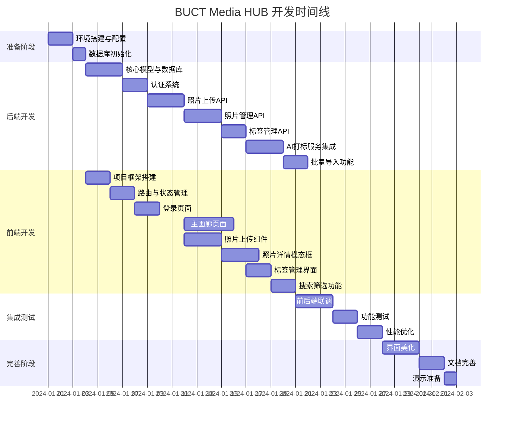

# BUCT Media HUB 开发实施计划

## 1. 项目概述

### 1.1 项目背景

基于现有的 BUCT Media HUB 系统设计文档,本计划旨在提供一个清晰、可执行的开发实施路线图,将设计转化为实际可用的系统。

### 1.2 核心目标

- 搭建完整的前后端分离架构
- 实现照片上传、管理、审核的核心功能
- 集成 AI 自动打标服务
- 提供精美的 Web 界面展示
- 支持从现有 BUCT Tagger 系统迁移数据

### 1.3 技术栈总览

**后端**: FastAPI + SQLAlchemy + SQLite + Pillow + Ollama  
**前端**: Vue 3 + TypeScript + Vite + Naive UI + TailwindCSS  
**开发模式**: 本地优先,展示优先

---

## 2. 开发阶段划分

### 2.1 开发路线图



### 2.2 阶段时间估算

| 阶段 | 预计时间 | 累计时间 |
|------|---------|---------|
| **阶段 0: 准备阶段** | 3 天 | 3 天 |
| **阶段 1: 后端核心开发** | 18 天 | 21 天 |
| **阶段 2: 前端核心开发** | 20 天 | 41 天 |
| **阶段 3: 集成测试** | 7 天 | 48 天 |
| **阶段 4: 完善与交付** | 6 天 | 54 天 |

**总计**: 约 54 天 (约 8 周)

---

## 3. 阶段 0: 准备阶段 (3 天)

### 3.1 环境搭建

#### 任务 0.1: 安装开发工具

**目标**: 配置本地开发环境

**检查清单**:
- Python 3.10+ 已安装
- Node.js 18+ 已安装
- Git 已安装并配置
- VS Code 或 PyCharm 已配置
- SQLite 客户端工具 (DB Browser for SQLite)

**验证方式**:
- 命令行执行 `python --version` 输出 3.10+
- 命令行执行 `node --version` 输出 18+
- 命令行执行 `git --version` 正常输出

#### 任务 0.2: 创建项目目录结构

**目标**: 建立标准化的代码仓库结构

**操作步骤**:

1. 创建根目录结构

| 目录/文件 | 用途 | 说明 |
|----------|------|------|
| `/backend/` | 后端代码 | FastAPI 项目 |
| `/frontend/` | 前端代码 | Vue 3 项目 |
| `/docs/` | 文档 | API、数据库文档 |
| `/scripts/` | 工具脚本 | 数据迁移、初始化脚本 |
| `/.gitignore` | Git 忽略规则 | 排除敏感文件 |
| `/README.md` | 项目说明 | 快速开始指南 |

2. 初始化 Git 仓库

**验证方式**:
- 目录结构符合预期
- Git 仓库已初始化
- 首次提交完成

#### 任务 0.3: 后端环境初始化

**目标**: 搭建 FastAPI 开发环境

**操作步骤**:

1. 创建 Python 虚拟环境
2. 创建 `requirements.txt` 文件,包含以下依赖:

| 包名 | 版本 | 用途 |
|------|------|------|
| fastapi | 0.109+ | Web 框架 |
| uvicorn | 0.27+ | ASGI 服务器 |
| sqlalchemy | 2.0+ | ORM 框架 |
| alembic | 1.13+ | 数据库迁移 |
| pydantic | 2.0+ | 数据验证 |
| pydantic-settings | 2.0+ | 配置管理 |
| python-multipart | 0.0.9+ | 文件上传 |
| python-jose | 3.3+ | JWT 处理 |
| passlib | 1.7+ | 密码加密 |
| bcrypt | 4.0+ | 密码哈希 |
| pillow | 10.2+ | 图像处理 |
| aiosqlite | 0.19+ | SQLite 异步驱动 |

3. 安装依赖: `pip install -r requirements.txt`

4. 创建 `.env.example` 文件模板

5. 复制为 `.env` 并配置本地环境变量

**验证方式**:
- 虚拟环境激活成功
- 所有依赖安装无报错
- 可以导入 `import fastapi` 无报错

#### 任务 0.4: 前端环境初始化

**目标**: 搭建 Vue 3 开发环境

**操作步骤**:

1. 使用 Vite 创建 Vue 3 + TypeScript 项目
2. 安装核心依赖:

| 包名 | 版本 | 用途 |
|------|------|------|
| vue | 3.4+ | 核心框架 |
| vue-router | 4.2+ | 路由管理 |
| pinia | 2.1+ | 状态管理 |
| axios | 1.6+ | HTTP 客户端 |
| naive-ui | 2.38+ | UI 组件库 |
| tailwindcss | 3.4+ | 样式框架 |
| @vueuse/core | 10.9+ | 工具库 |

3. 配置 TailwindCSS

4. 配置 TypeScript 严格模式

5. 创建 `.env.development` 文件

**验证方式**:
- `npm run dev` 启动成功
- 浏览器访问 `http://localhost:5173` 显示默认页面
- 热更新正常工作

---

## 4. 阶段 1: 后端核心开发 (18 天)

### 4.1 Sprint 1.1: 数据库模型与基础设施 (3 天)

#### 任务 1.1.1: 创建 ORM 模型

**目标**: 实现所有数据表的 SQLAlchemy 模型

**文件清单**:
- `app/models/user.py` - 用户模型
- `app/models/photo.py` - 照片模型
- `app/models/tag.py` - 标签模型
- `app/models/photo_tag.py` - 照片标签关联模型
- `app/models/task.py` - 任务模型
- `app/models/task_photo.py` - 任务照片关联模型

**User 模型字段**:
- id (UUID, PK)
- email (String, UK)
- hashed_password (String)
- full_name (String)
- role (String, default='user')
- is_active (Boolean, default=True)
- created_at (DateTime)

**Photo 模型字段**:
- id (UUID, PK)
- uploader_id (UUID, FK)
- filename (String)
- original_path (Text)
- processed_path (Text)
- thumb_path (Text)
- width (Integer)
- height (Integer)
- season (String)
- category (String)
- campus (String)
- exif_data (JSON)
- status (String, default='pending')
- processing_status (String, default='pending')
- created_at (DateTime)
- captured_at (DateTime)
- published_at (DateTime)

**Tag 模型字段**:
- id (Integer, PK, AutoIncrement)
- name (String, UK)
- category (String)
- color (String)
- usage_count (Integer, default=0)

**PhotoTag 关联表字段**:
- photo_id (UUID, FK, PK)
- tag_id (Integer, FK, PK)
- created_at (DateTime)

**验证方式**:
- 所有模型导入无报错
- 模型关系正确定义 (relationship)
- 索引定义完整

#### 任务 1.1.2: 配置数据库连接

**目标**: 实现数据库会话管理

**文件**: `app/core/database.py`

**实现内容**:
- 创建异步数据库引擎 (SQLite)
- 定义 SessionLocal 会话工厂
- 实现依赖注入函数 `get_db()`
- 配置数据库连接池参数

**验证方式**:
- 可以成功创建数据库会话
- 会话在请求结束后正确关闭

#### 任务 1.1.3: 初始化 Alembic 迁移

**目标**: 配置数据库版本控制

**操作步骤**:
1. 执行 `alembic init alembic`
2. 修改 `alembic/env.py` 引入模型
3. 修改 `alembic.ini` 配置数据库 URL
4. 创建初始迁移: `alembic revision --autogenerate -m "Initial tables"`
5. 执行迁移: `alembic upgrade head`

**验证方式**:
- 数据库文件 `buct_media.db` 创建成功
- 所有表结构正确创建
- 索引已创建

#### 任务 1.1.4: 创建 CRUD 基类

**目标**: 实现通用数据库操作

**文件**: `app/crud/base.py`

**实现功能**:
- `get(id)` - 根据 ID 查询单个记录
- `get_multi(skip, limit)` - 分页查询
- `create(obj_in)` - 创建记录
- `update(db_obj, obj_in)` - 更新记录
- `delete(id)` - 删除记录

**验证方式**:
- 基类方法可被继承
- 泛型类型定义正确

### 4.2 Sprint 1.2: 认证系统 (2 天)

#### 任务 1.2.1: 实现安全工具

**目标**: 配置 JWT 和密码加密

**文件**: `app/core/security.py`

**实现功能**:
- 密码哈希函数: `get_password_hash(password)`
- 密码验证函数: `verify_password(plain, hashed)`
- JWT 创建函数: `create_access_token(data, expires_delta)`
- JWT 验证函数: `decode_access_token(token)`

**配置项** (在 `app/core/config.py`):
- SECRET_KEY: JWT 签名密钥
- ALGORITHM: HS256
- ACCESS_TOKEN_EXPIRE_MINUTES: 30

**验证方式**:
- 密码哈希后无法反向解密
- 相同密码每次哈希结果不同
- JWT Token 可正确编码和解码

#### 任务 1.2.2: 实现认证端点

**目标**: 提供登录和获取用户信息接口

**文件**: `app/api/v1/endpoints/auth.py`

**API 端点**:

| 端点 | 方法 | 功能 | 请求 | 响应 |
|------|------|------|------|------|
| `/api/v1/auth/login` | POST | 用户登录 | `{email, password}` | `{access_token, token_type, user}` |
| `/api/v1/auth/me` | GET | 获取当前用户 | Header: Authorization | `{user_info}` |

**Pydantic Schema** (在 `app/schemas/`):
- `TokenResponse`: access_token, token_type, user
- `UserResponse`: id, email, full_name, role
- `LoginRequest`: email, password

**验证方式**:
- 正确用户名密码返回 Token
- 错误密码返回 401 Unauthorized
- 使用 Token 可获取用户信息
- 无效 Token 返回 401

#### 任务 1.2.3: 创建初始管理员用户

**目标**: 提供系统初始化脚本

**文件**: `scripts/create_admin.py`

**功能**:
- 检查是否已存在管理员
- 创建默认管理员账号
  - email: `admin@buct.edu.cn`
  - password: `admin123` (首次登录需修改)
  - role: `admin`

**验证方式**:
- 脚本执行成功
- 数据库中存在管理员记录
- 可使用管理员账号登录

### 4.3 Sprint 1.3: 照片上传 API (3 天)

#### 任务 1.3.1: 实现文件存储服务

**目标**: 处理图片文件的保存

**文件**: `app/services/storage.py`

**实现功能**:
- `save_upload_file(file, upload_dir)` - 保存上传文件
- `generate_unique_filename(original_filename)` - 生成 UUID 文件名
- `ensure_directory_exists(path)` - 确保目录存在
- `delete_file(file_path)` - 删除文件

**目录结构**:
```
uploads/
├── originals/     # 原图
└── thumbnails/    # 缩略图
```

**验证方式**:
- 上传文件保存到正确位置
- 文件名使用 UUID 格式
- 目录不存在时自动创建

#### 任务 1.3.2: 实现图像处理服务

**目标**: 生成缩略图和提取 EXIF

**文件**: `app/services/image_processing.py`

**实现功能**:
- `create_thumbnail(image_path, thumb_path, size)` - 生成缩略图
- `extract_exif(image_path)` - 提取 EXIF 元数据
- `get_image_dimensions(image_path)` - 获取图片宽高

**缩略图规格**:
- 宽度: 400px
- 高度: 按比例缩放
- 格式: JPEG
- 质量: 85

**EXIF 提取字段**:
- date_taken (拍摄时间)
- camera_model (相机型号)
- lens_model (镜头型号)
- iso (ISO 值)
- aperture (光圈)
- shutter_speed (快门速度)
- focal_length (焦距)

**验证方式**:
- 缩略图尺寸正确
- EXIF 数据提取完整
- 无 EXIF 的图片不报错

#### 任务 1.3.3: 实现照片上传端点

**目标**: 提供批量上传接口

**文件**: `app/api/v1/endpoints/photos.py`

**API 端点**:

| 端点 | 方法 | 功能 | 请求 | 响应 |
|------|------|------|------|------|
| `/api/v1/photos/upload` | POST | 上传照片 | `multipart/form-data: files[]` | `[{id, filename, status}]` |

**处理流程**:
1. 验证文件类型 (jpg, png, webp)
2. 验证文件大小 (最大 20MB)
3. 生成 UUID
4. 保存原图到 `uploads/originals/{uuid}.jpg`
5. 提取 EXIF 信息
6. 生成缩略图到 `uploads/thumbnails/{uuid}_thumb.jpg`
7. 创建 Photo 记录 (status='pending', processing_status='pending')
8. 触发后台 AI 打标任务
9. 返回照片信息

**错误处理**:
- 文件类型不支持: 400 Bad Request
- 文件过大: 413 Payload Too Large
- 存储失败: 500 Internal Server Error

**验证方式**:
- 可上传单张图片
- 可上传多张图片
- 返回数据包含 UUID
- 文件存储在正确位置
- 数据库记录创建成功

### 4.4 Sprint 1.4: 照片管理 API (3 天)

#### 任务 1.4.1: 实现照片查询端点

**目标**: 提供分页查询和筛选功能

**API 端点**:

| 端点 | 方法 | 功能 | 请求参数 | 响应 |
|------|------|------|---------|------|
| `/api/v1/photos` | GET | 获取照片列表 | page, size, status, season, category, campus, tags | `{items[], total, page, size}` |
| `/api/v1/photos/{photo_id}` | GET | 获取照片详情 | - | `{photo, tags[]}` |

**查询参数说明**:
- `page`: 页码 (默认 1)
- `size`: 每页数量 (默认 20, 最大 100)
- `status`: 照片状态 (pending/approved/rejected)
- `season`: 季节筛选 (Spring/Summer/Autumn/Winter)
- `category`: 分类筛选 (Landscape/Portrait/Activity/Documentary)
- `campus`: 校区筛选
- `tags`: 标签筛选 (逗号分隔)

**响应字段**:
- 照片基本信息 (id, filename, width, height...)
- 缩略图路径
- 标签列表
- 上传者信息
- EXIF 元数据

**验证方式**:
- 无参数查询返回所有照片
- 分页参数正确工作
- 筛选条件正确过滤
- 标签筛选支持多标签

#### 任务 1.4.2: 实现照片更新端点

**目标**: 允许修改照片属性

**API 端点**:

| 端点 | 方法 | 功能 | 请求体 | 响应 |
|------|------|------|-------|------|
| `/api/v1/photos/{photo_id}` | PATCH | 更新照片信息 | `{season?, category?, campus?}` | `{updated_photo}` |

**可更新字段**:
- season: 季节
- category: 分类
- campus: 校区

**验证**:
- season 只能是: Spring/Summer/Autumn/Winter
- category 只能是: Landscape/Portrait/Activity/Documentary

**验证方式**:
- 更新成功返回更新后的数据
- 字段验证错误返回 422
- 不存在的 photo_id 返回 404

#### 任务 1.4.3: 实现照片审核端点

**目标**: 提供上线/下线操作

**API 端点**:

| 端点 | 方法 | 功能 | 请求 | 响应 |
|------|------|------|------|------|
| `/api/v1/photos/{photo_id}/approve` | POST | 审核通过 | - | `{updated_photo}` |
| `/api/v1/photos/{photo_id}/reject` | POST | 下线 | - | `{updated_photo}` |
| `/api/v1/photos/batch-approve` | POST | 批量上线 | `{photo_ids[]}` | `{updated_count}` |
| `/api/v1/photos/batch-reject` | POST | 批量下线 | `{photo_ids[]}` | `{updated_count}` |

**审核通过逻辑**:
- status 设为 'approved'
- published_at 设为当前时间

**下线逻辑**:
- status 设为 'rejected'
- published_at 清空

**验证方式**:
- 单张审核成功修改状态
- 批量操作正确处理多张照片
- 操作记录日志

#### 任务 1.4.4: 实现照片删除端点

**目标**: 支持软删除

**API 端点**:

| 端点 | 方法 | 功能 | 响应 |
|------|------|------|------|
| `/api/v1/photos/{photo_id}` | DELETE | 删除照片 | `{message}` |

**删除逻辑**:
- 软删除: status 设为 'deleted'
- 不删除物理文件
- 查询时默认排除已删除照片

**验证方式**:
- 删除后照片不在列表中
- 文件仍存在于磁盘
- 数据库记录仍存在

### 4.5 Sprint 1.5: 标签管理 API (2 天)

#### 任务 1.5.1: 实现标签 CRUD

**目标**: 提供标签管理接口

**API 端点**:

| 端点 | 方法 | 功能 | 请求 | 响应 |
|------|------|------|------|------|
| `/api/v1/tags` | GET | 获取标签列表 | `?search=&category=` | `{tags[]}` |
| `/api/v1/tags` | POST | 创建新标签 | `{name, category?, color?}` | `{tag}` |
| `/api/v1/tags/{tag_id}` | PATCH | 更新标签 | `{name?, category?, color?}` | `{tag}` |
| `/api/v1/tags/{tag_id}` | DELETE | 删除标签 | - | `{message}` |
| `/api/v1/tags/popular` | GET | 获取热门标签 | `?limit=20` | `{tags[]}` |

**搜索功能**:
- 支持标签名称模糊搜索
- 支持按分类筛选

**热门标签**:
- 按 usage_count 降序排序
- 默认返回前 20 个

**验证方式**:
- 创建标签成功
- 标签名称自动转小写
- 重复标签名返回错误
- 搜索功能正常

#### 任务 1.5.2: 实现照片标签关联

**目标**: 管理照片和标签的关系

**API 端点**:

| 端点 | 方法 | 功能 | 请求 | 响应 |
|------|------|------|------|------|
| `/api/v1/photos/{photo_id}/tags` | POST | 添加标签 | `{tag_names[]}` | `{photo_tags[]}` |
| `/api/v1/photos/{photo_id}/tags/{tag_id}` | DELETE | 移除标签 | - | `{message}` |
| `/api/v1/photos/{photo_id}/tags` | PUT | 替换所有标签 | `{tag_names[]}` | `{photo_tags[]}` |

**添加标签逻辑**:
1. 遍历 tag_names 数组
2. 查找或创建标签 (不存在则自动创建)
3. 创建 PhotoTag 关联
4. 增加标签的 usage_count

**移除标签逻辑**:
1. 删除 PhotoTag 关联
2. 减少标签的 usage_count

**替换标签逻辑**:
1. 删除所有现有关联
2. 按添加逻辑处理新标签列表

**验证方式**:
- 添加新标签成功
- 添加已存在的标签成功
- 移除标签成功
- 替换标签成功
- usage_count 正确更新

### 4.6 Sprint 1.6: AI 打标服务集成 (3 天)

#### 任务 1.6.1: 实现 AI 服务接口

**目标**: 封装 Ollama API 调用

**文件**: `app/services/ai_tagging.py`

**实现功能**:
- `analyze_image(image_path)` - 分析图片返回标签

**AI 调用流程**:
1. 读取图片文件
2. 压缩至 1024px (减少 Token 消耗)
3. 将图片转为 base64 编码
4. 构建 Prompt
5. 调用 Ollama API (model: llava)
6. 解析 JSON 响应
7. 返回结构化结果

**Prompt 模板**:
```
请分析这张图片。

1. 判断季节 (Spring/Summer/Autumn/Winter)。

2. 判断场景类型 (Landscape/Portrait/Activity/Documentary)。

3. 提取画面中的关键物体 (不超过5个) 使用中文标签。

请以纯JSON格式返回，不要包含Markdown格式标记，格式如下:

{
    "season": "...",
    "category": "...",
    "objects": ["...", "..."]
}
```

**返回格式**:
```python
{
    "season": "Winter",
    "category": "Landscape",
    "objects": ["砖墙", "建筑", "门", "天空", "雪花"]
}
```

**错误处理**:
- Ollama 服务不可用: 标记为 failed
- JSON 解析失败: 记录日志并重试
- 超时: 30 秒超时限制

**验证方式**:
- 可成功调用 Ollama
- 返回 JSON 格式正确
- 错误情况正确处理

#### 任务 1.6.2: 实现后台任务处理

**目标**: 异步处理 AI 打标

**文件**: `app/services/ai_tagging.py`

**实现功能**:
- `process_photo_tagging(photo_id, db)` - 后台任务函数

**处理流程**:
1. 更新 processing_status 为 'processing'
2. 读取照片文件
3. 调用 AI 分析
4. 更新 Photo 记录:
   - season
   - category
5. 处理 objects 数组:
   - 查找或创建 Tag
   - 创建 PhotoTag 关联
6. 更新 processing_status 为 'completed'

**错误处理**:
- 任何异常: processing_status 设为 'failed'
- 记录错误日志

**验证方式**:
- 上传后自动触发 AI 分析
- processing_status 正确更新
- 标签自动创建

#### 任务 1.6.3: 配置 AI 服务选项

**目标**: 支持多种 AI 服务

**配置项** (在 `.env`):
- `AI_ENABLED`: 是否启用 AI (True/False)
- `AI_PROVIDER`: 服务提供商 (ollama/dashscope)
- `OLLAMA_API_URL`: Ollama 地址
- `OLLAMA_MODEL`: 模型名称 (llava)
- `DASHSCOPE_API_KEY`: 阿里云 API Key (可选)

**实现逻辑**:
- AI_ENABLED=False 时跳过 AI 处理
- 根据 AI_PROVIDER 选择不同实现
- Ollama 优先,失败时可降级为手动

**验证方式**:
- 配置切换正常工作
- 禁用 AI 时不影响上传
- 两种服务都可正常调用

### 4.7 Sprint 1.7: 批量导入功能 (2 天)

#### 任务 1.7.1: 实现 JSON 解析服务

**目标**: 解析 BUCT Tagger 数据格式

**文件**: `app/services/import_service.py`

**实现功能**:
- `parse_json_file(json_path)` - 解析单个 JSON 文件
- `scan_json_files(directory)` - 递归扫描目录
- `validate_json_format(data)` - 验证 JSON 格式

**支持的 JSON 格式**:
```json
[
  {
    "uuid": "62d59449-3aad-4a61-adda-937459eb0be2",
    "filename": "1765016943275.png",
    "original_path": "D:\\path\\to\\image.png",
    "width": 2560,
    "height": 1369,
    "tags": {
      "attributes": {
        "season": "Winter",
        "category": "Landscape"
      },
      "keywords": ["砖墙", "建筑", "门"],
      "meta": {}
    }
  }
]
```

**验证方式**:
- 可解析标准格式 JSON
- 格式错误时返回错误信息
- 递归扫描正确遍历子目录

#### 任务 1.7.2: 实现批量导入端点

**目标**: 提供数据导入接口

**API 端点**:

| 端点 | 方法 | 功能 | 请求 | 响应 |
|------|------|------|------|------|
| `/api/v1/photos/import` | POST | 批量导入 | `{json_path, image_folder?}` | `{imported_count, skipped_count, errors[]}` |

**导入流程**:
1. 解析 JSON 文件或扫描目录
2. 遍历每条记录:
   - 检查 UUID 是否已存在 (跳过重复)
   - 查找图片文件 (多种路径策略)
   - 复制到 uploads/originals/
   - 生成缩略图
   - 创建 Photo 记录
   - 创建标签关联
3. 返回导入统计

**路径查找策略**:
1. 使用 original_path (如果是绝对路径且存在)
2. JSON 同级目录
3. image_folder 参数指定的目录
4. JSON 目录下的 images/ 子目录

**验证方式**:
- 可成功导入单个 JSON
- 可批量导入目录
- 重复数据正确跳过
- 返回详细统计信息

#### 任务 1.7.3: 实现导入进度跟踪

**目标**: 支持大批量导入

**实现方式**:
- 使用后台任务处理
- 创建 ImportTask 表记录进度
- 提供查询进度的接口

**ImportTask 字段**:
- id (UUID)
- status (pending/processing/completed/failed)
- total_count (总数)
- processed_count (已处理)
- imported_count (成功导入)
- skipped_count (跳过数量)
- errors (错误列表)
- created_at
- completed_at

**API 端点**:

| 端点 | 方法 | 功能 | 响应 |
|------|------|------|------|
| `/api/v1/import/tasks/{task_id}` | GET | 查询导入进度 | `{task_info}` |

**验证方式**:
- 大批量导入不阻塞
- 可实时查询进度
- 完成后显示详细结果

---

## 5. 阶段 2: 前端核心开发 (20 天)

### 5.1 Sprint 2.1: 项目框架搭建 (2 天)

#### 任务 2.1.1: 初始化 Vue 项目

**目标**: 创建标准化的前端项目结构

**操作步骤**:
1. 执行 `npm create vite@latest frontend -- --template vue-ts`
2. 进入 frontend 目录
3. 执行 `npm install`

**目录结构**:
```
frontend/
├── public/
├── src/
│   ├── assets/
│   ├── components/
│   ├── views/
│   ├── stores/
│   ├── services/
│   ├── router/
│   ├── types/
│   ├── utils/
│   ├── App.vue
│   └── main.ts
├── index.html
├── vite.config.ts
├── tsconfig.json
└── package.json
```

**验证方式**:
- 项目正常启动
- TypeScript 无报错

#### 任务 2.1.2: 安装核心依赖

**目标**: 配置完整的技术栈

**依赖清单**:

```json
{
  "dependencies": {
    "vue": "^3.4.0",
    "vue-router": "^4.2.0",
    "pinia": "^2.1.0",
    "axios": "^1.6.0",
    "naive-ui": "^2.38.0",
    "@vicons/ionicons5": "^0.12.0"
  },
  "devDependencies": {
    "@vitejs/plugin-vue": "^5.0.0",
    "typescript": "^5.0.0",
    "vite": "^5.0.0",
    "vue-tsc": "^1.8.0",
    "tailwindcss": "^3.4.0",
    "autoprefixer": "^10.4.0",
    "postcss": "^8.4.0"
  }
}
```

**安装命令**:
```bash
npm install vue vue-router pinia axios naive-ui @vicons/ionicons5
npm install -D @vitejs/plugin-vue typescript vite vue-tsc tailwindcss autoprefixer postcss
```

**验证方式**:
- 所有依赖安装成功
- 无版本冲突警告

#### 任务 2.1.3: 配置 TailwindCSS

**目标**: 集成样式框架

**操作步骤**:
1. 执行 `npx tailwindcss init -p`
2. 配置 `tailwind.config.js`
3. 创建 `src/assets/styles/global.css`
4. 在 main.ts 中导入

**tailwind.config.js**:
```javascript
module.exports = {
  content: [
    "./index.html",
    "./src/**/*.{vue,js,ts,jsx,tsx}",
  ],
  theme: {
    extend: {
      colors: {
        primary: '#1e3a8a',
        secondary: '#3b82f6',
      }
    },
  },
  plugins: [],
}
```

**验证方式**:
- TailwindCSS 类名生效
- 热更新正常

#### 任务 2.1.4: 配置 Naive UI

**目标**: 集成 UI 组件库

**操作步骤**:
1. 创建 `src/plugins/naive-ui.ts`
2. 配置全局组件注册
3. 配置主题

**验证方式**:
- Naive UI 组件可正常使用
- 主题色配置生效

### 5.2 Sprint 2.2: 路由与状态管理 (2 天)

#### 任务 2.2.1: 配置 Vue Router

**目标**: 实现页面路由

**文件**: `src/router/index.ts`

**路由配置**:

| 路径 | 组件 | 说明 | 权限 |
|------|------|------|------|
| `/login` | LoginView | 登录页 | 公开 |
| `/` | GalleryView | 主画廊 | 需登录 |
| `/upload` | UploadView | 上传页面 | 需登录 |
| `/photos/:id` | PhotoDetailView | 照片详情 | 需登录 |
| `/tags` | TagManageView | 标签管理 | 需登录 |

**路由守卫**:
- 检查登录状态
- 未登录跳转到 /login
- 已登录访问 /login 跳转到 /

**验证方式**:
- 路由跳转正常
- 路由守卫生效
- URL 变化正确

#### 任务 2.2.2: 配置 Pinia Store

**目标**: 实现状态管理

**Store 清单**:

1. **authStore** (`src/stores/auth.ts`)
   - state: user, token, isAuthenticated
   - actions: login(), logout(), fetchUser()

2. **photoStore** (`src/stores/photo.ts`)
   - state: photos, total, currentPage, filters
   - actions: fetchPhotos(), uploadPhotos(), updatePhoto()

3. **tagStore** (`src/stores/tag.ts`)
   - state: tags, popularTags
   - actions: fetchTags(), createTag(), deleteTag()

4. **uploadStore** (`src/stores/upload.ts`)
   - state: uploadQueue, uploadProgress
   - actions: addToQueue(), removeFromQueue(), startUpload()

**验证方式**:
- State 可跨组件访问
- Actions 正常工作
- 数据持久化 (token 存储在 localStorage)

#### 任务 2.2.3: 封装 API 服务

**目标**: 统一管理 API 调用

**文件**: `src/services/api.ts`

**Axios 实例配置**:
- baseURL: 从环境变量读取
- timeout: 30000
- 请求拦截器: 添加 Authorization Header
- 响应拦截器: 统一错误处理

**服务模块**:

1. **authService** (`src/services/auth.service.ts`)
   - login(email, password)
   - getMe()

2. **photoService** (`src/services/photo.service.ts`)
   - getPhotos(params)
   - getPhoto(id)
   - uploadPhotos(files)
   - updatePhoto(id, data)
   - approvePhoto(id)
   - deletePhoto(id)

3. **tagService** (`src/services/tag.service.ts`)
   - getTags(params)
   - createTag(data)
   - updateTag(id, data)
   - deleteTag(id)
   - addPhotoTags(photoId, tagNames)

**验证方式**:
- API 调用成功
- Token 自动添加
- 错误统一处理

### 5.3 Sprint 2.3: 登录页面 (2 天)

#### 任务 2.3.1: 实现登录表单

**目标**: 创建精美的登录页面

**文件**: `src/views/auth/LoginView.vue`

**组件结构**:
- 全屏背景 (校园风景渐变图)
- 居中登录卡片
- 邮箱输入框
- 密码输入框
- 记住我复选框
- 登录按钮 (带加载状态)

**表单验证**:
- 邮箱格式验证
- 密码不为空
- 实时错误提示

**登录逻辑**:
1. 提交表单
2. 调用 authService.login()
3. 保存 token 到 localStorage
4. 保存 user 到 authStore
5. 跳转到主页

**错误处理**:
- 显示错误提示信息
- 401: 用户名或密码错误
- 500: 服务器错误

**验证方式**:
- 正确账号可登录
- 错误账号显示错误
- 登录后跳转到主页
- Token 正确保存

#### 任务 2.3.2: 实现视觉设计

**目标**: 打造精美的登录界面

**设计要点**:
- 背景: 深蓝色渐变 + 半透明遮罩
- 卡片: 白色背景, 圆角 1rem, 阴影 shadow-2xl
- 输入框: 聚焦时蓝色边框动画
- 按钮: 主色调, 悬停加深, 加载时显示 spinner
- Logo: BUCT Media HUB 文字 + 图标

**响应式设计**:
- Mobile: 卡片宽度 90%
- Tablet: 卡片宽度 500px
- Desktop: 卡片宽度 500px

**验证方式**:
- 界面美观专业
- 动画流畅
- 响应式正常

### 5.4 Sprint 2.4: 主画廊页面 (4 天)

#### 任务 2.4.1: 实现页面布局

**目标**: 搭建主画廊结构

**文件**: `src/views/gallery/GalleryView.vue`

**布局组件**:
- AppHeader (顶部导航栏)
- AppSidebar (左侧筛选栏)
- PhotoGrid (照片瀑布流)
- PhotoDetail (详情模态框)

**AppHeader 功能**:
- Logo
- 搜索框 (支持模糊搜索)
- 上传按钮
- 用户头像菜单 (登出)

**AppSidebar 功能**:
- 季节筛选 (全部/春/夏/秋/冬)
- 分类筛选 (风景/人像/活动/纪实)
- 状态筛选 (待审核/已上线/已下线)
- 校区筛选

**验证方式**:
- 布局正确显示
- 响应式布局正常
- 侧边栏可折叠

#### 任务 2.4.2: 实现照片卡片组件

**目标**: 创建照片展示卡片

**文件**: `src/components/photo/PhotoCard.vue`

**卡片结构**:
- 缩略图 (懒加载)
- 文件名
- 标签列表 (最多显示 3 个)
- 上传日期
- 悬停工具栏 (编辑/删除/下载)

**Props**:
- photo: Photo 对象

**Events**:
- @click: 点击卡片
- @edit: 点击编辑
- @delete: 点击删除

**验证方式**:
- 卡片样式美观
- 悬停效果流畅
- 事件正常触发

#### 任务 2.4.3: 实现瀑布流布局

**目标**: 实现照片网格展示

**文件**: `src/components/photo/PhotoGrid.vue`

**实现方案**: 使用 CSS Grid

**配置**:
- 列数: 根据屏幕宽度自适应 (1-5 列)
- 间距: 1rem
- 宽度: 固定列宽, 高度按比例

**响应式列数**:
- < 640px: 1 列
- 640px - 768px: 2 列
- 768px - 1024px: 3 列
- 1024px - 1280px: 4 列
- > 1280px: 5 列

**验证方式**:
- 照片正确排列
- 响应式布局正常
- 性能良好

#### 任务 2.4.4: 实现无限滚动

**目标**: 滚动加载更多照片

**实现方式**: 使用 IntersectionObserver

**逻辑**:
1. 在列表底部放置哨兵元素
2. 监听哨兵元素可见性
3. 可见时加载下一页
4. 追加到现有列表

**状态管理**:
- isLoading: 是否正在加载
- hasMore: 是否还有更多数据
- currentPage: 当前页码

**验证方式**:
- 滚动到底部自动加载
- 加载时显示 loading 提示
- 没有更多数据时显示提示

#### 任务 2.4.5: 实现筛选功能

**目标**: 支持多条件筛选

**筛选条件**:
- 季节 (season)
- 分类 (category)
- 状态 (status)
- 校区 (campus)
- 标签 (tags)
- 搜索关键词 (search)

**实现逻辑**:
1. 侧边栏选择筛选条件
2. 更新 photoStore 的 filters
3. 重新调用 fetchPhotos()
4. 重置分页到第一页

**URL 同步**:
- 筛选条件保存到 URL 参数
- 刷新页面保持筛选状态

**验证方式**:
- 单个筛选条件生效
- 多个筛选条件组合生效
- URL 参数正确更新

### 5.5 Sprint 2.5: 照片上传组件 (3 天)

#### 任务 2.5.1: 实现上传页面

**目标**: 创建上传界面

**文件**: `src/views/upload/UploadView.vue`

**页面结构**:
- 拖拽上传区域
- 上传队列列表
- 进度统计

**验证方式**:
- 页面正常显示
- 路由跳转正常

#### 任务 2.5.2: 实现文件上传组件

**目标**: 实现拖拽上传功能

**文件**: `src/components/photo/PhotoUploader.vue`

**功能**:
- 拖拽上传 (Drag & Drop)
- 点击选择文件
- 多文件选择
- 文件类型验证 (jpg/png/webp)
- 文件大小验证 (< 20MB)
- 预览缩略图

**拖拽事件**:
- dragover: 显示高亮边框
- dragleave: 移除高亮
- drop: 添加文件到队列

**验证方式**:
- 拖拽上传正常
- 点击选择正常
- 验证规则生效
- 预览显示正常

#### 任务 2.5.3: 实现上传队列管理

**目标**: 管理待上传文件列表

**uploadStore 功能**:
- 添加文件到队列
- 移除队列中的文件
- 批量上传
- 上传进度跟踪

**队列项结构**:
```typescript
interface UploadItem {
  id: string;
  file: File;
  preview: string;  // 预览 URL
  progress: number; // 0-100
  status: 'pending' | 'uploading' | 'success' | 'error';
  error?: string;
}
```

**上传逻辑**:
1. 遍历队列
2. 逐个上传文件
3. 更新进度
4. 处理结果

**验证方式**:
- 队列正确管理
- 进度正确显示
- 成功/失败状态正确

#### 任务 2.5.4: 实现上传进度显示

**目标**: 实时显示上传进度

**UI 组件**:
- 每个文件显示独立进度条
- 整体上传进度
- 上传统计 (总数/已完成/失败)

**进度获取**:
- 使用 Axios 的 onUploadProgress
- 计算百分比
- 更新到 uploadStore

**验证方式**:
- 进度条实时更新
- 百分比准确
- 统计信息正确

### 5.6 Sprint 2.6: 照片详情模态框 (3 天)

#### 任务 2.6.1: 实现详情模态框

**目标**: 创建照片详情弹窗

**文件**: `src/components/photo/PhotoDetail.vue`

**布局**:
- 左侧: 高清大图 (支持缩放)
- 右侧: 照片信息和操作

**右侧面板内容**:
- 基本信息 (文件名/尺寸/大小/拍摄时间)
- 分类属性 (季节/类别/校区) - 可编辑
- 标签列表 - 可编辑
- 审核操作 (上线/下线按钮)

**快捷键**:
- 左箭头: 上一张
- 右箭头: 下一张
- ESC: 关闭

**验证方式**:
- 模态框正常显示
- 数据正确加载
- 快捷键生效

#### 任务 2.6.2: 实现图片查看器

**目标**: 支持图片缩放和旋转

**功能**:
- 滚轮缩放
- 拖拽移动
- 双击重置
- 旋转按钮

**实现方式**:
- 使用 CSS transform
- 监听鼠标和触摸事件
- 平滑动画过渡

**验证方式**:
- 缩放流畅
- 拖拽正常
- 旋转正确

#### 任务 2.6.3: 实现属性编辑

**目标**: 支持修改照片属性

**可编辑字段**:
- season: 下拉选择
- category: 下拉选择
- campus: 下拉选择

**编辑逻辑**:
1. 点击编辑按钮
2. 切换为编辑模式
3. 修改后点击保存
4. 调用 updatePhoto API
5. 更新本地数据

**验证方式**:
- 编辑模式切换正常
- 保存成功更新数据
- 取消恢复原值

#### 任务 2.6.4: 实现标签编辑

**目标**: 管理照片标签

**文件**: `src/components/photo/TagInput.vue`

**功能**:
- 显示现有标签
- 添加新标签 (自动完成)
- 删除标签
- 标签搜索建议

**自动完成逻辑**:
1. 输入关键词
2. 防抖 300ms
3. 调用 searchTags API
4. 显示下拉建议
5. 选择或创建新标签

**验证方式**:
- 标签显示正常
- 添加标签成功
- 删除标签成功
- 自动完成工作正常

### 5.7 Sprint 2.7: 标签管理与搜索 (2 天)

#### 任务 2.7.1: 实现标签管理页面

**目标**: 提供标签库管理界面

**文件**: `src/views/admin/TagManageView.vue`

**功能**:
- 标签列表展示
- 创建新标签
- 编辑标签
- 删除标签
- 查看使用统计

**列表字段**:
- 标签名称
- 分类
- 颜色
- 使用次数
- 操作按钮

**验证方式**:
- 列表正确显示
- CRUD 操作成功
- 使用统计准确

#### 任务 2.7.2: 实现搜索功能

**目标**: 支持照片搜索

**搜索方式**:
- 关键词搜索 (文件名)
- 标签搜索
- 高级筛选组合

**搜索框实现**:
- 输入防抖
- 搜索建议 (热门标签)
- 搜索历史

**验证方式**:
- 搜索结果正确
- 防抖生效
- 建议准确

#### 任务 2.7.3: 实现批量操作

**目标**: 支持批量选择和操作

**功能**:
- 多选照片 (复选框)
- 全选/反选
- 批量上线
- 批量下线
- 批量添加标签

**UI 交互**:
- 选中时显示操作工具栏
- 显示选中数量
- 操作确认提示

**验证方式**:
- 多选正常工作
- 批量操作成功
- 提示信息正确

### 5.8 Sprint 2.8: 界面美化 (2 天)

#### 任务 2.8.1: 优化视觉设计

**目标**: 提升整体视觉效果

**优化项**:
- 统一色彩方案
- 完善组件样式
- 添加过渡动画
- 优化间距和布局

**色彩方案**:
- 主色: #1e3a8a (深蓝)
- 辅助色: #3b82f6 (亮蓝)
- 成功: #10b981 (绿)
- 警告: #f59e0b (橙)
- 错误: #ef4444 (红)

**验证方式**:
- 界面美观统一
- 动画流畅自然
- 色彩搭配协调

#### 任务 2.8.2: 优化交互体验

**目标**: 提升用户体验

**优化项**:
- 加载状态反馈
- 操作成功提示
- 错误友好提示
- 骨架屏加载
- 空状态占位

**Toast 提示**:
- 成功: 绿色 + 对勾图标
- 错误: 红色 + 叉号图标
- 警告: 橙色 + 感叹号图标

**验证方式**:
- 反馈及时准确
- 提示信息友好
- 空状态优雅

---

## 6. 阶段 3: 集成测试 (7 天)

### 6.1 Sprint 3.1: 前后端联调 (3 天)

#### 任务 3.1.1: 登录流程测试

**测试场景**:
- 正确用户名密码登录成功
- 错误密码登录失败
- Token 正确保存和使用
- 登出清除 Token

**验证要点**:
- 登录后可访问受保护页面
- Token 过期自动跳转登录
- 刷新页面保持登录状态

#### 任务 3.1.2: 照片上传流程测试

**测试场景**:
- 单张照片上传
- 批量照片上传
- 大文件上传 (接近 20MB)
- 不支持格式上传 (应失败)

**验证要点**:
- 上传成功返回照片信息
- 缩略图正确生成
- AI 打标自动触发
- 进度条正确显示

#### 任务 3.1.3: 照片管理流程测试

**测试场景**:
- 查看照片列表
- 筛选照片
- 搜索照片
- 查看照片详情
- 编辑照片属性
- 添加/删除标签
- 审核上线/下线
- 批量操作

**验证要点**:
- 所有操作成功
- 数据实时更新
- 错误正确处理

#### 任务 3.1.4: 批量导入流程测试

**测试场景**:
- 导入单个 JSON 文件
- 导入包含多个 JSON 的目录
- 导入重复数据 (应跳过)
- 导入错误格式 (应报错)

**验证要点**:
- 导入成功创建记录
- 图片文件正确复制
- 标签正确关联
- 统计信息准确

### 6.2 Sprint 3.2: 功能测试 (2 天)

#### 任务 3.2.1: 编写测试用例

**测试清单**:

| 模块 | 功能点 | 测试用例 |
|------|-------|---------|
| 认证 | 登录 | 正确/错误密码/Token 过期 |
| 上传 | 单张上传 | 成功/格式错误/大小超限 |
| 上传 | 批量上传 | 多文件/进度显示 |
| 列表 | 分页查询 | 翻页/每页数量 |
| 列表 | 筛选 | 单条件/多条件组合 |
| 列表 | 搜索 | 关键词搜索 |
| 详情 | 查看 | 正确显示所有字段 |
| 详情 | 编辑属性 | 修改季节/分类/校区 |
| 详情 | 编辑标签 | 添加/删除/替换 |
| 审核 | 单张审核 | 上线/下线 |
| 审核 | 批量审核 | 批量上线/下线 |
| 标签 | 创建 | 新标签/重复标签 |
| 标签 | 搜索 | 模糊搜索 |
| 导入 | 单文件 | 成功导入 |
| 导入 | 目录 | 递归扫描 |
| 导入 | 去重 | 跳过重复 |

#### 任务 3.2.2: 执行测试并记录结果

**测试方式**:
- 手动测试所有用例
- 记录通过/失败情况
- 截图关键步骤
- 记录发现的 Bug

**Bug 分类**:
- P0: 阻塞性问题 (登录失败/上传失败)
- P1: 严重问题 (功能不可用)
- P2: 一般问题 (体验不佳)
- P3: 优化建议

### 6.3 Sprint 3.3: 性能优化 (2 天)

#### 任务 3.3.1: 前端性能优化

**优化项**:
- 路由懒加载
- 组件懒加载
- 图片懒加载
- 虚拟滚动 (大列表)
- 防抖和节流
- 资源压缩

**验证指标**:
- 首屏加载时间 < 2s
- 页面切换 < 500ms
- 滚动流畅 (60fps)

#### 任务 3.3.2: 后端性能优化

**优化项**:
- 数据库查询优化
- 索引优化
- 缩略图缓存
- API 响应压缩
- 并发控制

**验证指标**:
- API 响应时间 < 300ms
- 批量导入速度 > 10 张/秒
- 并发上传支持 > 5 个用户

#### 任务 3.3.3: 错误处理完善

**优化项**:
- 统一错误提示
- 网络错误重试
- 超时处理
- 异常日志记录

**验证方式**:
- 断网后友好提示
- 超时自动重试
- 错误信息清晰

---

## 7. 阶段 4: 完善与交付 (6 天)

### 7.1 Sprint 4.1: 文档完善 (3 天)

#### 任务 4.1.1: 编写 API 文档

**目标**: 补充 API 接口文档

**文件**: `docs/API.md`

**内容**:
- 所有端点列表
- 请求参数说明
- 响应格式说明
- 错误码说明
- 示例代码

**格式**:
- 使用 Markdown 表格
- 提供 cURL 示例
- 标注必填/可选参数

#### 任务 4.1.2: 编写部署指南

**目标**: 提供完整部署文档

**文件**: `docs/DEPLOYMENT.md`

**内容**:
- 环境要求
- 依赖安装
- 配置说明
- 启动步骤
- 常见问题

#### 任务 4.1.3: 编写用户手册

**目标**: 提供操作指南

**文件**: `docs/USER_GUIDE.md`

**内容**:
- 登录说明
- 上传照片步骤
- 管理照片方法
- 标签使用技巧
- 批量导入指南

**配图**:
- 关键步骤截图
- 操作流程图

### 7.2 Sprint 4.2: 演示准备 (2 天)

#### 任务 4.2.1: 准备演示数据

**目标**: 准备高质量演示数据

**数据清单**:
- 50-100 张校园照片
- 覆盖四季
- 覆盖各种分类
- 标签丰富

**操作步骤**:
1. 收集照片素材
2. 批量上传
3. 等待 AI 打标完成
4. 人工校验和完善标签
5. 审核上线

#### 任务 4.2.2: 制作演示脚本

**目标**: 准备演示流程

**演示内容**:
1. 登录系统
2. 查看主画廊 (展示瀑布流)
3. 筛选和搜索 (展示灵活性)
4. 上传照片 (展示拖拽上传)
5. 查看详情 (展示 AI 标签)
6. 编辑标签 (展示人工微调)
7. 批量操作 (展示效率)
8. 批量导入 (展示数据迁移)

**时长**: 10-15 分钟

#### 任务 4.2.3: 录制演示视频

**目标**: 制作演示视频

**工具**: OBS Studio / Camtasia

**内容**:
- 完整功能演示
- 配音解说
- 字幕说明

**规格**:
- 分辨率: 1920x1080
- 时长: 8-10 分钟
- 格式: MP4

### 7.3 Sprint 4.3: 最终检查 (1 天)

#### 任务 4.3.1: 代码质量检查

**检查项**:
- 代码格式化 (Prettier)
- TypeScript 无报错
- ESLint 无警告
- 注释完整
- 无 console.log

#### 任务 4.3.2: 安全检查

**检查项**:
- 敏感信息已移除
- .env 文件未提交
- Token 正确保护
- SQL 注入防护
- XSS 防护

#### 任务 4.3.3: 项目打包

**操作**:
- 前端构建: `npm run build`
- 后端依赖锁定: `pip freeze > requirements.txt`
- 清理临时文件
- 压缩代码包

**交付物**:
- 源代码压缩包
- 文档压缩包
- 演示视频
- README.md

---

## 8. 风险管理与应对

### 8.1 技术风险

| 风险 | 影响 | 概率 | 应对措施 |
|------|------|------|----------|
| AI 服务不稳定 | 自动打标失败 | 中 | 降级为手动打标,不阻塞上传 |
| 大文件上传超时 | 用户体验差 | 中 | 增加超时时间,提供断点续传 |
| 数据库性能瓶颈 | 查询缓慢 | 低 | 优化索引,增加缓存 |
| 前端渲染卡顿 | 浏览器卡死 | 中 | 实现虚拟滚动,图片懒加载 |

### 8.2 进度风险

| 风险 | 影响 | 应对措施 |
|------|------|----------|
| 任务评估不准 | 延期 | 每周检查进度,及时调整 |
| 技术难点卡壳 | 延期 | 预留缓冲时间,寻求技术支持 |
| 需求变更 | 重做 | 锁定核心功能,扩展功能后置 |

### 8.3 质量风险

| 风险 | 影响 | 应对措施 |
|------|------|----------|
| Bug 过多 | 无法交付 | 增加测试时间,提前测试 |
| 性能不达标 | 体验差 | 性能测试前置,及时优化 |
| 安全漏洞 | 数据泄露 | 安全检查,代码审查 |

---

## 9. 开发规范

### 9.1 代码规范

**Python 代码规范**:
- 遵循 PEP 8
- 使用类型注解
- 函数文档字符串 (docstring)
- 变量命名清晰

**TypeScript 代码规范**:
- 使用 ESLint
- 严格模式
- 接口定义完整
- 组件命名 PascalCase

### 9.2 Git 规范

**分支策略**:
- main: 稳定版本
- dev: 开发分支
- feature/*: 功能分支
- bugfix/*: 修复分支

**Commit 规范**:
- feat: 新功能
- fix: 修复 Bug
- docs: 文档更新
- style: 代码格式
- refactor: 重构
- test: 测试
- chore: 构建/工具

**示例**:
```
feat(auth): implement login functionality
fix(upload): resolve file size validation issue
docs(api): update photo endpoints documentation
```

### 9.3 测试规范

**测试类型**:
- 单元测试: 关键函数
- 集成测试: API 端点
- E2E 测试: 核心流程

**测试覆盖率**:
- 后端: > 70%
- 前端: > 50%

---

## 10. 交付标准

### 10.1 功能完整性

- [ ] 用户登录/登出
- [ ] 照片上传 (单张/批量)
- [ ] 照片列表查询
- [ ] 照片筛选搜索
- [ ] 照片详情查看
- [ ] 照片属性编辑
- [ ] 照片标签管理
- [ ] 照片审核上线
- [ ] 批量操作
- [ ] 标签库管理
- [ ] AI 自动打标
- [ ] 批量导入

### 10.2 性能标准

- [ ] 首屏加载 < 2s
- [ ] API 响应 < 300ms
- [ ] 上传成功率 > 95%
- [ ] 无内存泄漏
- [ ] 并发支持 > 5 用户

### 10.3 质量标准

- [ ] 无 P0/P1 Bug
- [ ] 代码格式规范
- [ ] 文档完整
- [ ] 测试覆盖率达标
- [ ] 安全检查通过

### 10.4 文档完整性

- [ ] 系统设计文档
- [ ] API 接口文档
- [ ] 数据库设计文档
- [ ] 部署指南
- [ ] 用户手册
- [ ] README.md

---

## 11. 附录

### 11.1 技术资源

**学习资料**:
- FastAPI 官方文档: https://fastapi.tiangolo.com/
- Vue 3 官方文档: https://vuejs.org/
- Naive UI 文档: https://www.naiveui.com/
- TailwindCSS 文档: https://tailwindcss.com/
- Ollama 文档: https://github.com/ollama/ollama

**工具推荐**:
- API 测试: Postman / Insomnia
- 数据库管理: DB Browser for SQLite
- 代码编辑器: VS Code
- Git 客户端: GitHub Desktop / SourceTree

### 11.2 环境变量模板

**后端 .env.example**:
```ini
APP_NAME=BUCT Media HUB
DEBUG=True
DATABASE_URL=sqlite:///./buct_media.db
UPLOAD_DIR=./uploads
SECRET_KEY=your-secret-key
OLLAMA_API_URL=http://localhost:11434
AI_ENABLED=True
ALLOWED_ORIGINS=http://localhost:5173
```

**前端 .env.development**:
```ini
VITE_API_BASE_URL=http://localhost:8000
VITE_APP_TITLE=BUCT Media HUB
VITE_MAX_UPLOAD_SIZE=20
```

### 11.3 快速开始命令

**后端启动**:
```bash
cd backend
python -m venv venv
source venv/bin/activate  # Windows: venv\Scripts\activate
pip install -r requirements.txt
alembic upgrade head
python scripts/create_admin.py
uvicorn app.main:app --reload --port 8000
```

**前端启动**:
```bash
cd frontend
npm install
npm run dev
```

**访问地址**:
- 前端: http://localhost:5173
- 后端 API 文档: http://localhost:8000/docs
- 后端 Admin: http://localhost:8000/admin

---

**开发愉快! 🚀**

