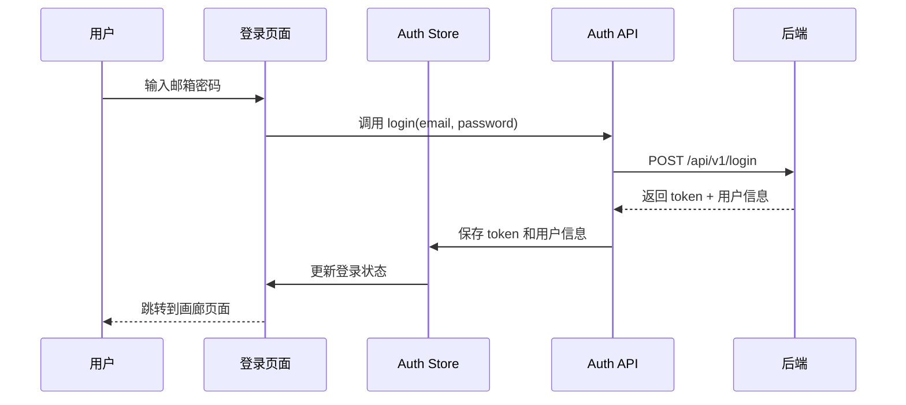
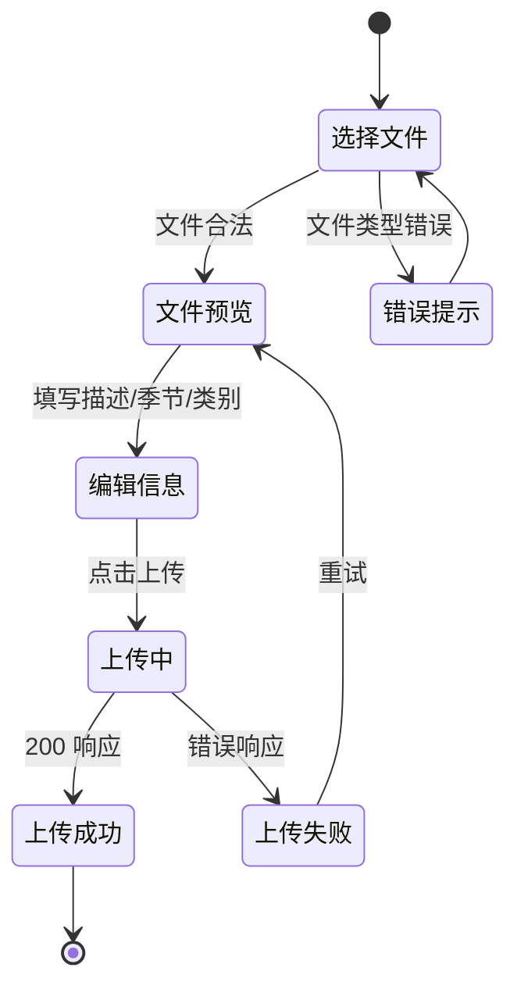
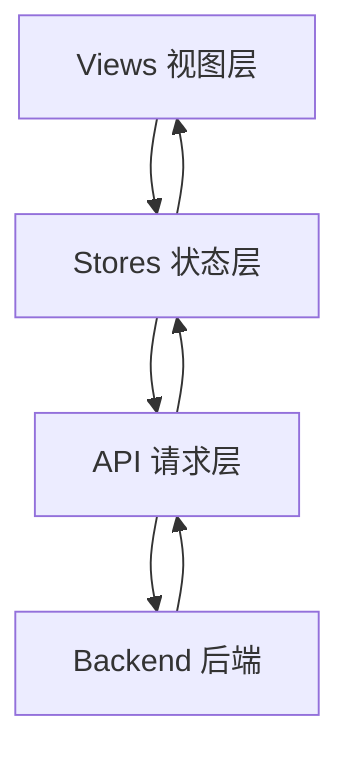

# BUCT Media HUB 项目进度跟进与前端开发设计

## 1. 项目进度分析

### 1.1 后端开发状态

**已完成部分：**

- ✅ **项目架构搭建**
  - FastAPI 应用框架已建立
  - 模块化项目结构（models、schemas、crud、api、services）已规范化
  - 配置管理系统（基于 Pydantic Settings）已实现

- ✅ **数据模型设计**
  - User 模型：用户认证与授权，支持角色管理（admin/user）
  - Photo 模型：完整的照片元数据管理，包含状态流转、EXIF 数据、分类信息
  - Tag 模型：标签系统支持
  - Task 模型：任务管理支持

- ✅ **核心 API 端点**
  - 认证模块（/api/v1/login, /api/v1/token, /api/v1/me）
  - 照片上传（POST /api/v1/photos/upload）
  - 照片列表查询（GET /api/v1/photos）支持分页、过滤、搜索
  - 照片详情获取（GET /api/v1/photos/{id}）
  - 照片更新（PATCH /api/v1/photos/{id}）
  - 照片删除（DELETE /api/v1/photos/{id}）
  - 标签管理（POST /api/v1/photos/{id}/tags）

- ✅ **基础服务层**
  - 文件存储服务（本地文件系统）
  - 图像处理服务（缩略图生成、EXIF 提取）
  - JWT 认证与安全机制

- ✅ **数据库迁移**
  - Alembic 配置完成
  - 初始数据库 Schema 迁移脚本已生成

**技术栈确认：**
- 后端：FastAPI + SQLAlchemy + Alembic + SQLite（开发阶段）
- 认证：JWT (OAuth2 Password Bearer)
- 图像处理：Pillow
- 数据库：SQLite（本地优先策略）

### 1.2 前端开发状态

**当前状态：**
- ❌ **前端目录为空** - 前端项目尚未初始化
- 需要从零开始搭建 Vue 3 应用

**缺失组件分析：**
1. 前端框架未初始化
2. 用户界面未实现
3. 与后端 API 的集成未建立
4. 状态管理未配置
5. 路由系统未设计

## 2. 前端开发设计方案

### 2.1 技术栈选型

**核心框架：**
- **Vue 3** - 使用 Composition API（Script Setup 语法）
- **TypeScript** - 提供类型安全
- **Vite** - 构建工具，提供快速的开发体验

**UI 组件库：**
- **Naive UI** - 现代化、类型友好的 Vue 3 组件库
- 提供完整的表单、表格、对话框、上传等组件
- 内置暗色模式支持

**状态管理：**
- **Pinia** - Vue 3 官方推荐的状态管理方案
- 简洁的 API，完善的 TypeScript 支持

**路由管理：**
- **Vue Router 4** - Vue 3 官方路由解决方案

**HTTP 客户端：**
- **Axios** - 成熟的 HTTP 请求库
- 支持请求/响应拦截器（用于自动注入 JWT Token）

**工具库：**
- **VueUse** - Composition API 工具集
- **day.js** - 轻量级日期处理库

### 2.2 项目结构设计

```
frontend/
├── public/
│   └── favicon.ico
├── src/
│   ├── api/                    # API 请求封装
│   │   ├── index.ts           # Axios 实例配置
│   │   ├── auth.ts            # 认证相关 API
│   │   ├── photo.ts           # 照片相关 API
│   │   └── types.ts           # API 类型定义
│   ├── assets/                # 静态资源
│   │   └── styles/
│   │       ├── main.css       # 全局样式
│   │       └── variables.css  # CSS 变量
│   ├── components/            # 可复用组件
│   │   ├── common/            # 通用组件
│   │   │   ├── ImageUploader.vue
│   │   │   ├── ImageGrid.vue
│   │   │   ├── TagSelector.vue
│   │   │   └── EmptyState.vue
│   │   ├── photo/             # 照片相关组件
│   │   │   ├── PhotoCard.vue
│   │   │   ├── PhotoDetail.vue
│   │   │   ├── PhotoFilter.vue
│   │   │   └── PhotoEditor.vue
│   │   └── layout/            # 布局组件
│   │       ├── AppHeader.vue
│   │       ├── AppSidebar.vue
│   │       └── AppFooter.vue
│   ├── composables/           # 组合式函数
│   │   ├── useAuth.ts         # 认证逻辑
│   │   ├── usePhoto.ts        # 照片操作逻辑
│   │   └── useUpload.ts       # 上传逻辑
│   ├── router/                # 路由配置
│   │   ├── index.ts           # 路由主配置
│   │   └── guards.ts          # 路由守卫
│   ├── stores/                # 状态管理
│   │   ├── index.ts           # Pinia 配置
│   │   ├── auth.ts            # 用户认证状态
│   │   ├── photo.ts           # 照片数据状态
│   │   └── app.ts             # 应用全局状态
│   ├── types/                 # TypeScript 类型定义
│   │   ├── user.ts
│   │   ├── photo.ts
│   │   └── api.ts
│   ├── utils/                 # 工具函数
│   │   ├── request.ts         # 请求封装
│   │   ├── auth.ts            # 认证工具
│   │   └── format.ts          # 格式化工具
│   ├── views/                 # 页面视图
│   │   ├── Login.vue          # 登录页
│   │   ├── Gallery.vue        # 照片画廊（主页）
│   │   ├── Upload.vue         # 上传页面
│   │   └── NotFound.vue       # 404 页面
│   ├── App.vue                # 根组件
│   └── main.ts                # 应用入口
├── index.html
├── package.json
├── tsconfig.json
├── vite.config.ts
└── README.md
```

### 2.3 核心功能模块设计

#### 2.3.1 认证模块

**功能描述：**
用户登录、登出、状态保持

**关键流程：**



**状态设计（Auth Store）：**
- `user`: 当前用户信息（User 对象或 null）
- `token`: JWT 访问令牌（string 或 null）
- `isAuthenticated`: 是否已认证（computed）

**行为设计（Auth Store）：**
- `login(email, password)`: 用户登录
- `logout()`: 用户登出，清除 token
- `fetchCurrentUser()`: 获取当前用户信息
- `initFromStorage()`: 从 localStorage 恢复登录状态

**持久化策略：**
- Token 存储在 `localStorage` 中（key: `auth_token`）
- 应用启动时自动读取并验证 token 有效性

#### 2.3.2 照片画廊模块

**功能描述：**
照片列表展示、筛选、搜索、分页

**布局设计：**

```
+----------------------------------------------------------+
|  Header: 搜索框 | 筛选器（季节/类别/状态） | 上传按钮 | 用户  |
+----------------------------------------------------------+
| Sidebar          |  主内容区 - 照片网格                    |
| - 全部照片       |  +--------+  +--------+  +--------+     |
| - 按季节         |  | Photo1 |  | Photo2 |  | Photo3 |     |
|   - Spring       |  | 缩略图 |  | 缩略图 |  | 缩略图 |     |
|   - Summer       |  +--------+  +--------+  +--------+     |
|   - Autumn       |                                         |
|   - Winter       |  +--------+  +--------+  +--------+     |
| - 按类别         |  | Photo4 |  | Photo5 |  | Photo6 |     |
| - 待审核         |  +--------+  +--------+  +--------+     |
+----------------------------------------------------------+
|  Footer: 分页器 (共 200 张，第 1/10 页)                  |
+----------------------------------------------------------+
```

**交互行为：**

| 用户操作 | 系统响应 |
|---------|---------|
| 点击照片缩略图 | 打开照片详情模态框，显示大图、元数据、标签 |
| 点击筛选器 | 更新查询参数，重新请求照片列表 |
| 输入搜索关键词 | 防抖后发送搜索请求 |
| 滚动到底部 | 加载下一页（无限滚动模式，可选） |
| 点击上传按钮 | 打开上传组件或跳转上传页面 |

**状态设计（Photo Store）：**
- `photos`: 照片列表（Photo[] 数组）
- `total`: 照片总数
- `currentPage`: 当前页码
- `pageSize`: 每页数量
- `filters`: 筛选条件（季节、类别、状态、搜索词）
- `loading`: 加载状态
- `selectedPhoto`: 当前选中照片（用于详情展示）

**行为设计（Photo Store）：**
- `fetchPhotos(params)`: 获取照片列表
- `fetchPhotoDetail(id)`: 获取照片详情
- `updatePhoto(id, data)`: 更新照片信息
- `deletePhoto(id)`: 删除照片
- `setFilters(filters)`: 更新筛选条件
- `clearFilters()`: 清除筛选条件

#### 2.3.3 照片上传模块

**功能描述：**
单张或批量上传照片，支持拖拽上传、预览、元数据编辑

**上传流程：**



**组件设计（ImageUploader）：**

**Props（输入属性）：**
- `multiple`: 是否支持多选（boolean，默认 true）
- `maxSize`: 单个文件最大尺寸（number，默认 20MB）
- `accept`: 接受的文件类型（string，默认 'image/*'）

**Events（输出事件）：**
- `success`: 上传成功（payload: Photo 对象）
- `error`: 上传失败（payload: Error 对象）

**内部状态：**
- `files`: 待上传文件列表（File[] 数组）
- `previews`: 文件预览 URL 列表（Map<File, string>）
- `uploadProgress`: 每个文件的上传进度（Map<File, number>）
- `uploadStatus`: 每个文件的上传状态（Map<File, 'pending'|'uploading'|'success'|'error'>）

**交互设计：**
- 支持点击选择文件和拖拽放置文件两种方式
- 文件选择后立即生成缩略图预览
- 每个预览项显示：缩略图、文件名、文件大小、删除按钮
- 批量上传时显示总体进度条
- 单个文件上传失败后可单独重试

#### 2.3.4 照片详情模块

**功能描述：**
查看高分辨率照片、展示元数据、编辑标签、修改分类

**模态框布局：**

```
+-------------------------------------------------------+
|  [关闭 X]                                              |
|  +-------------------+  +---------------------------+  |
|  |                   |  | 文件名: IMG_2024.jpg       |  |
|  |                   |  | 上传时间: 2024-03-20       |  |
|  |     大图展示      |  | 拍摄时间: 2024-03-15       |  |
|  |   (可缩放/拖拽)    |  | 尺寸: 4032x3024           |  |
|  |                   |  | 季节: [Spring ▼]          |  |
|  |                   |  | 类别: [Landscape ▼]       |  |
|  +-------------------+  | 描述: [可编辑文本框]       |  |
|                         | 标签: 🏷️教学楼 🏷️樱花    |  |
|                         |      [+ 添加标签]          |  |
|                         | EXIF 数据: [展开/收起]     |  |
|                         | - 相机: Canon EOS R5      |  |
|                         | - 光圈: f/2.8             |  |
|                         | - 快门: 1/500s            |  |
|                         | [保存修改] [删除照片]      |  |
+-------------------------------------------------------+
```

**编辑功能：**
- 季节和类别通过下拉选择器修改
- 描述通过文本框编辑
- 标签支持添加和删除（使用 Tag 输入组件）
- 保存按钮仅在有修改时启用
- 删除照片需二次确认

#### 2.3.5 筛选与搜索模块

**筛选维度：**

| 筛选类型 | UI 组件 | 值选项 |
|---------|---------|--------|
| 季节 | 多选复选框组 | Spring, Summer, Autumn, Winter |
| 类别 | 多选复选框组 | Landscape, Portrait, Activity, Documentary |
| 状态 | 单选按钮组 | 全部, 待审核(pending), 已上线(approved), 已拒绝(rejected) |
| 搜索 | 搜索输入框 | 自由文本（匹配文件名和描述） |

**筛选交互：**
- 筛选条件变更立即触发列表刷新
- 支持多条件组合（AND 逻辑）
- 显示当前激活的筛选标签（可点击移除）
- 提供"清除全部筛选"快捷按钮

**搜索优化：**
- 使用防抖（debounce）机制，用户停止输入 500ms 后发送请求
- 搜索框显示加载指示器
- 无结果时显示空状态提示

### 2.4 数据流设计

#### 2.4.1 状态管理架构



**Pinia Store 职责划分：**

**Auth Store（认证状态）：**
- 用户信息管理
- Token 管理
- 登录/登出逻辑
- 权限判断

**Photo Store（照片状态）：**
- 照片列表缓存
- 筛选条件管理
- 分页状态
- CRUD 操作

**App Store（应用状态）：**
- 主题模式（亮色/暗色）
- 侧边栏折叠状态
- 全局加载状态
- 通知消息队列

#### 2.4.2 API 请求封装设计

**Axios 实例配置：**

**基础配置：**
- `baseURL`: 从环境变量读取（开发环境默认 `http://localhost:8000`）
- `timeout`: 请求超时设置（30秒）
- `headers`: 默认 Content-Type 为 `application/json`

**请求拦截器：**
- 自动从 Auth Store 读取 token
- 将 token 添加到请求头 `Authorization: Bearer {token}`
- 为每个请求添加唯一 request ID（用于日志追踪）

**响应拦截器：**
- 统一处理 200-299 状态码（成功）
- 401 状态码：清除 token，跳转到登录页
- 403 状态码：显示权限不足提示
- 404 状态码：显示资源不存在提示
- 500 状态码：显示服务器错误提示
- 网络错误：显示连接失败提示

**API 模块化封装示例：**

Photo API 模块包含以下方法：
- `getPhotos(params)`: 获取照片列表（支持分页、筛选、搜索）
- `getPhotoById(id)`: 获取单个照片详情
- `uploadPhoto(file, metadata)`: 上传照片
- `updatePhoto(id, data)`: 更新照片信息
- `deletePhoto(id)`: 删除照片
- `updatePhotoTags(id, tagIds)`: 更新照片标签

Auth API 模块包含以下方法：
- `login(email, password)`: 用户登录
- `getCurrentUser()`: 获取当前用户信息
- `logout()`: 用户登出（可选，前端清除 token 即可）

### 2.5 路由设计

**路由表：**

| 路径 | 名称 | 组件 | 元信息 | 说明 |
|------|------|------|--------|------|
| `/login` | Login | Login.vue | `{ requiresAuth: false }` | 登录页面 |
| `/` | Gallery | Gallery.vue | `{ requiresAuth: true }` | 照片画廊（首页） |
| `/upload` | Upload | Upload.vue | `{ requiresAuth: true }` | 上传页面 |
| `/:pathMatch(.*)` | NotFound | NotFound.vue | - | 404 页面 |

**路由守卫逻辑：**

**全局前置守卫（beforeEach）：**

```
对于每个路由跳转：
  如果目标路由需要认证（requiresAuth: true）：
    检查 Auth Store 中是否有有效 token
    如果有 token：
      允许访问
    如果没有 token：
      重定向到 /login，并保存原目标路径（用于登录后跳回）
  如果目标路由是登录页（/login）：
    检查是否已登录
    如果已登录：
      重定向到首页 /
    如果未登录：
      允许访问
  其他情况：
    允许访问
```

### 2.6 用户体验优化策略

#### 2.6.1 性能优化

**图片加载优化：**
- 列表页仅加载缩略图（后端生成的 thumb_path）
- 详情页按需加载原图
- 使用图片懒加载（Intersection Observer）
- 图片加载失败显示占位图

**虚拟滚动（可选）：**
- 当照片数量超过 100 张时，启用虚拟滚动
- 仅渲染可视区域内的照片卡片
- 减少 DOM 节点数量，提升渲染性能

**请求优化：**
- 避免重复请求（使用请求缓存或状态缓存）
- 使用防抖和节流控制高频操作
- 上传大文件时显示进度条

#### 2.6.2 交互体验

**加载状态反馈：**
- 数据加载时显示骨架屏（Skeleton）或加载动画
- 按钮点击后显示加载状态（禁用 + Spinner）
- 长时间操作显示进度条

**错误处理：**
- 所有错误统一通过全局消息组件（Message/Notification）展示
- 错误信息清晰明确，提供可操作的建议
- 网络错误提供"重试"按钮

**操作反馈：**
- 成功操作显示成功提示（绿色）
- 危险操作（删除）需二次确认
- 表单验证即时反馈

**响应式设计：**
- 支持桌面端（≥1024px）和移动端（<768px）
- 移动端优化触摸交互
- 侧边栏在小屏幕上自动折叠

### 2.7 主题与样式设计

**设计原则：**
- 简洁现代的视觉风格
- 照片内容优先，UI 元素不喧宾夺主
- 充足的留白，避免视觉拥挤

**色彩方案：**

**亮色模式：**
- 主色：蓝色系（#1890ff）- 用于主要按钮、链接
- 背景：白色/浅灰（#ffffff, #f5f5f5）
- 文本：深灰/黑（#333333, #666666）
- 边框：浅灰（#e0e0e0）

**暗色模式：**
- 主色：亮蓝色（#40a9ff）
- 背景：深灰/黑（#1f1f1f, #2a2a2a）
- 文本：白色/浅灰（#ffffff, #cccccc）
- 边框：深灰（#444444）

**组件样式规范：**
- 卡片圆角：8px
- 按钮圆角：4px
- 阴影：轻微阴影，避免过度立体效果
- 间距：遵循 8px 基础单元（8, 16, 24, 32...）

## 3. 开发实施计划

### 3.1 阶段划分

**第一阶段：项目初始化（预计 1 天）**
- 创建 Vite + Vue 3 + TypeScript 项目
- 安装依赖（Naive UI, Vue Router, Pinia, Axios, VueUse）
- 配置 TypeScript、Vite、ESLint
- 搭建基础目录结构
- 配置环境变量（.env.development, .env.production）

**第二阶段：基础设施（预计 2 天）**
- 实现 Axios 请求封装（请求/响应拦截器）
- 创建 API 模块（auth.ts, photo.ts）
- 实现 Pinia Store（auth, photo, app）
- 配置 Vue Router 和路由守卫
- 实现全局错误处理和消息提示

**第三阶段：认证功能（预计 1 天）**
- 开发登录页面（Login.vue）
- 实现登录表单验证
- 集成登录 API
- 实现 token 持久化
- 实现自动登录和登出

**第四阶段：照片画廊（预计 3 天）**
- 开发画廊页面布局（Header, Sidebar, Content）
- 实现照片列表展示（PhotoCard 组件）
- 实现筛选功能（PhotoFilter 组件）
- 实现搜索功能（防抖处理）
- 实现分页功能
- 实现照片详情模态框（PhotoDetail 组件）
- 集成照片 CRUD API

**第五阶段：上传功能（预计 2 天）**
- 开发上传组件（ImageUploader）
- 实现拖拽上传
- 实现文件预览
- 实现批量上传
- 实现上传进度显示
- 集成上传 API

**第六阶段：优化与完善（预计 2 天）**
- 实现图片懒加载
- 优化性能（虚拟滚动可选）
- 实现响应式设计
- 实现暗色模式切换
- 完善错误处理
- 编写组件文档

**总计：约 11 天**

### 3.2 开发优先级

**P0（核心功能，必须完成）：**
1. 用户登录/登出
2. 照片列表展示
3. 照片上传（单张）
4. 照片详情查看

**P1（重要功能，优先完成）：**
1. 照片筛选（季节、类别、状态）
2. 照片搜索
3. 照片编辑（描述、分类）
4. 照片删除
5. 批量上传

**P2（增强功能，时间允许时完成）：**
1. 标签管理
2. 暗色模式
3. 虚拟滚动
4. 图片懒加载
5. 响应式移动端适配

### 3.3 技术风险与应对

**风险点 1：大量照片导致页面卡顿**
- 应对：实现分页加载，每页限制在 20-50 张
- 应对：使用缩略图而非原图
- 应对：可选实现虚拟滚动

**风险点 2：大文件上传失败或超时**
- 应对：前端限制单个文件最大 20MB
- 应对：设置合理的请求超时时间（60秒）
- 应对：实现上传失败重试机制

**风险点 3：跨域问题**
- 应对：后端已配置 CORS（允许 localhost:5173）
- 应对：开发环境可使用 Vite proxy 代理

**风险点 4：TypeScript 类型定义复杂**
- 应对：优先保证核心功能，类型定义逐步完善
- 应对：参考后端 Pydantic Schema 定义前端类型

## 4. 环境配置与依赖清单

### 4.1 开发环境要求

- **Node.js**: 18.0.0 或更高版本
- **包管理器**: npm 或 pnpm（推荐 pnpm）
- **编辑器**: VS Code（推荐安装 Vue、TypeScript、ESLint 插件）

### 4.2 核心依赖清单

**生产依赖：**
- `vue`: ^3.4.0
- `vue-router`: ^4.3.0
- `pinia`: ^2.1.0
- `axios`: ^1.6.0
- `naive-ui`: ^2.38.0
- `dayjs`: ^1.11.0
- `@vueuse/core`: ^10.9.0

**开发依赖：**
- `vite`: ^5.2.0
- `typescript`: ^5.4.0
- `@vitejs/plugin-vue`: ^5.0.0
- `@types/node`: ^20.12.0
- `eslint`: ^8.57.0
- `eslint-plugin-vue`: ^9.24.0
- `@typescript-eslint/parser`: ^7.5.0

### 4.3 环境变量配置

**.env.development（开发环境）：**
```
VITE_API_BASE_URL=http://localhost:8000
VITE_APP_TITLE=BUCT Media HUB - Dev
```

**.env.production（生产环境）：**
```
VITE_API_BASE_URL=/api
VITE_APP_TITLE=BUCT Media HUB
```

## 5. 与后端 API 的对接规范

### 5.1 请求头规范

所有请求必须包含：
- `Authorization: Bearer {token}` - JWT 令牌（除登录接口外）
- `Content-Type: application/json` - JSON 请求（文件上传除外）
- `Content-Type: multipart/form-data` - 文件上传请求

### 5.2 响应处理规范

**成功响应（2xx）：**
- 直接使用响应 body 中的数据
- 列表接口提取 `items`, `total`, `page`, `page_size`

**错误响应（4xx, 5xx）：**
- 从响应 body 中提取 `detail` 字段作为错误消息
- 401：清除 token，跳转登录
- 403：显示"权限不足"
- 404：显示"资源不存在"
- 500：显示"服务器错误"

### 5.3 API 端点映射

| 前端功能 | HTTP 方法 | API 路径 | 请求体 | 响应体 |
|---------|----------|---------|--------|--------|
| 登录 | POST | /api/v1/login | `{email, password}` | `{access_token, user}` |
| 获取当前用户 | GET | /api/v1/me | - | `User` |
| 获取照片列表 | GET | /api/v1/photos | Query 参数 | `{items, total, page, page_size}` |
| 获取照片详情 | GET | /api/v1/photos/{id} | - | `Photo` |
| 上传照片 | POST | /api/v1/photos/upload | FormData | `{id, filename, ...}` |
| 更新照片 | PATCH | /api/v1/photos/{id} | `PhotoUpdate` | `Photo` |
| 删除照片 | DELETE | /api/v1/photos/{id} | - | 204 无内容 |
| 更新标签 | POST | /api/v1/photos/{id}/tags | `{tag_ids}` | `Photo` |

## 6. 测试策略

### 6.1 单元测试

**测试工具：** Vitest（Vite 官方推荐）

**测试范围：**
- 工具函数（utils）
- Composables（可组合函数）
- Store actions（状态管理操作）

### 6.2 集成测试

**测试场景：**
- 登录流程端到端测试
- 照片上传流程测试
- 筛选和搜索功能测试

### 6.3 手动测试清单

**登录模块：**
- [ ] 正确的邮箱密码能成功登录
- [ ] 错误的密码显示错误提示
- [ ] 登录后自动跳转到画廊页面
- [ ] 刷新页面后保持登录状态
- [ ] 登出后清除 token 并跳转登录页

**照片画廊：**
- [ ] 照片列表正确展示
- [ ] 筛选条件变更后列表更新
- [ ] 搜索关键词后显示匹配结果
- [ ] 分页功能正常工作
- [ ] 点击照片打开详情模态框

**上传功能：**
- [ ] 点击选择文件能上传
- [ ] 拖拽文件能上传
- [ ] 显示上传进度
- [ ] 上传成功后跳转到画廊
- [ ] 上传失败显示错误信息

## 7. 文档与交付物

### 7.1 交付物清单

**代码仓库：**
- 完整的 frontend 目录源代码
- package.json 和 lock 文件
- 配置文件（vite.config.ts, tsconfig.json 等）

**文档：**
- README.md - 项目说明、启动指南
- API.md（可选）- API 调用示例
- CHANGELOG.md（可选）- 版本变更记录

**部署产物：**
- 生产构建产物（dist 目录）
- 部署说明文档

### 7.2 启动指南（README.md 内容）

**安装依赖：**
```bash
cd frontend
npm install
```

**启动开发服务器：**
```bash
npm run dev
# 访问 http://localhost:5173
```

**生产构建：**
```bash
npm run build
# 构建产物在 dist 目录
```

**预览生产构建：**
```bash
npm run preview
```

## 8. 后续扩展方向

### 8.1 短期优化（1-2 周）

1. **AI 打标集成**
   - 上传照片后自动调用 AI 服务生成标签
   - 显示 AI 建议标签，用户可确认或修改

2. **批量操作**
   - 批量选择照片
   - 批量修改季节/类别
   - 批量删除

3. **高级筛选**
   - 按上传时间范围筛选
   - 按拍摄时间范围筛选
   - 按文件大小筛选

### 8.2 中期功能（1-3 月）

1. **数据统计**
   - 照片数量统计图表
   - 季节分布饼图
   - 类别分布柱状图

2. **导出功能**
   - 导出筛选结果为 JSON
   - 批量下载照片（打包为 ZIP）

3. **用户管理**
   - 用户注册功能
   - 用户权限管理（管理员/普通用户）
   - 用户操作日志

### 8.3 长期愿景（3-6 月）

1. **协作功能**
   - 多用户协作标注
   - 照片审核工作流
   - 评论和讨论功能

2. **智能推荐**
   - 基于内容的相似照片推荐
   - 智能相册生成

3. **移动应用**
   - 开发移动端 App（React Native 或 Flutter）
   - 支持移动端拍照直接上传

## 9. 信心评估

**整体信心水平：高**

**信心基础：**
1. **后端基础扎实** - 后端 API 已完整实现，模型设计合理，为前端开发提供可靠支持
2. **技术栈成熟** - Vue 3 + TypeScript + Naive UI 组合经过大量项目验证，社区活跃
3. **需求明确** - 功能边界清晰，MVP 范围明确，避免了需求蔓延风险
4. **架构合理** - 前端架构设计模块化、可扩展，为后续迭代奠定基础
5. **风险可控** - 识别的技术风险均有明确应对方案

**关键成功因素：**
- 严格按照设计文档实施，避免过度设计
- 优先实现 P0 核心功能，保证 MVP 可用性
- 保持与后端 API 的同步，及时沟通接口变更
- 持续进行手动测试，保证用户体验

**潜在挑战：**
- TypeScript 类型定义工作量可能较大（应对：先保证功能，再完善类型）
- 大量照片的性能优化需要测试验证（应对：提前实现分页和懒加载）
