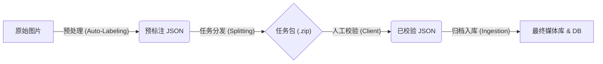

# BUCT Tagger 数据架构文档 (Data Architecture)

本文档详细描述了 BUCT 图片智能打标系统的输入输出结构、数据流向以及核心数据模式 (Schema)。本系统旨在作为图像数据处理的基础设施，支持从原始数据采集到最终入库的全生命周期管理。

## 1. 系统概览与数据流 (System Overview)

本系统由四个主要阶段组成，数据在各阶段间流转并逐渐丰富。



### 核心阶段输入输出矩阵

| 阶段 | 输入 (Input) | 处理核心 (Process) | 输出 (Output) |
| :--- | :--- | :--- | :--- |
| **1. 预处理** | `Raw Images Folder` | `pre_process.py` <br> (Qwen-VL + EXIF提取) | `pre_annotated.json` |
| **2. 分发** | `pre_annotated.json` <br> `Raw Images` | `preprocess_gui.py` <br> (JSON切分 + 图片拷贝 + ZIP打包) | `_dist/task_xxx/` <br> `task_xxx.zip` |
| **3. 校验** | `task_data.json` <br> `Task Images` | `gui.py` <br> (人工修正) | `task_data.json` (In-place update) |
| **4. 入库** | 多个任务包文件夹 | `import_gui.py` <br> (合并 + 归类 + SQL写入) | `Library/Season/uuid.jpg` <br> `buct_gallery.db` |

---

## 2. 核心数据模式 (Core Data Schema)

系统全程使用统一的 JSON 结构作为元数据载体。

### JSON 对象结构

每个列表项代表一张图片，结构如下：

```json
{
  "uuid": "550e8400-e29b-41d4-a716-446655440000",  // 全局唯一标识符 (UUIDv4)
  "filename": "IMG_2024.jpg",                     // 原始文件名
  "original_path": "D:/Photos/IMG_2024.jpg",      // 原始绝对路径 (在分发阶段会转换为相对路径)
  "processed_path": "",                           // (保留字段) 处理后路径
  "thumb_path": "",                               // (保留字段) 缩略图路径
  "width": 4032,                                  // 图片宽度
  "height": 3024,                                 // 图片高度
  "tags": {                                       // 标签信息集合
    "attributes": {                               // 固定属性
      "season": "Spring",                         // 季节: Spring, Summer, Autumn, Winter
      "category": "Landscape",                    // 类别: Landscape, Portrait, Activity, Documentary
      "campus": "North"                           // (可选) 校区
    },
    "keywords": [                                 // 关键物体/标签列表
      "教学楼",
      "樱花",
      "学生"
    ],
    "meta": {                                     // 元数据
      "date_taken": "2024-03-20 14:30:00",        // 拍摄时间 (来自 EXIF)
      "vlm_description": "..."                    // VLM 原始描述 (可选)
    }
  }
}
```

---

## 3. 数据库模式 (Database Schema)

最终数据存储在 SQLite 数据库 `buct_gallery.db` 中。

### 表结构: `photos`

| 字段名 | 类型 | 说明 | 对应 JSON 字段 |
| :--- | :--- | :--- | :--- |
| `uuid` | `TEXT PRIMARY KEY` | 主键，UUID | `uuid` |
| `filename` | `TEXT` | 文件名 | `filename` |
| `original_path` | `TEXT` | 原始路径记录 | `original_path` |
| `processed_path` | `TEXT` | **入库后的实际存储路径** | (入库时生成) |
| `thumb_path` | `TEXT` | 缩略图路径 | (入库时生成) |
| `width` | `INTEGER` | 宽度 | `width` |
| `height` | `INTEGER` | 高度 | `height` |
| `campus` | `TEXT` | 校区 | `tags.attributes.campus` |
| `season` | `TEXT` | 季节 | `tags.attributes.season` |
| `category` | `TEXT` | 类别 | `tags.attributes.category` |
| `keywords` | `TEXT` | JSON 字符串存储列表 | `tags.keywords` (dumps) |
| `meta` | `TEXT` | JSON 字符串存储元数据 | `tags.meta` (dumps) |
| `created_at` | `DATETIME` | 入库时间 | `CURRENT_TIMESTAMP` |
| `annotated_at` | `DATETIME` | 标注时间 | 入库执行时间 |

---

## 4. 文件系统结构 (File System Structure)

### A. 分发阶段 (Distribution)
当任务被切分时，生成如下结构，便于分发给不同人员：

```text
Project_Root/
└── source_filename_dist/          # 分发根目录
    ├── source_filename_task_001/  # 任务包 1
    │   ├── img_001.jpg            # 图片副本
    │   ├── img_002.jpg
    │   └── task_data.json         # 该任务包的元数据 (路径已转为相对路径)
    ├── source_filename_task_001.zip # 对应压缩包
    └── ...
```

### B. 入库阶段 (Ingestion/Archiving)
最终归档后的媒体库结构，按“季节”一级分类：

```text
Library_Root/ (e.g., D:/BUCT_Library)
├── Spring/
│   ├── {uuid_1}.jpg
│   ├── {uuid_2}.jpg
│   └── ...
├── Summer/
│   └── ...
├── Autumn/
│   └── ...
├── Winter/
│   └── ...
└── thumbs/ (可选)
    ├── Spring/
    │   ├── {uuid_1}_thumb.jpg
    │   └── ...
    └── ...
```

---

## 5. 关键配置参数 (Configuration)

系统行为受 `.env` 文件控制，影响输入输出的关键参数：

*   `API_BASE_URL`: 决定使用哪个 VLM 模型服务（本地或云端）。
*   `RESIZE_TARGET_SIZE`: 决定发送给 VLM 的图片压缩尺寸（影响识别精度与速度）。
*   `IMAGE_EXTENSIONS`: 定义系统识别的有效输入文件类型 (默认: .jpg, .png, .webp)。
